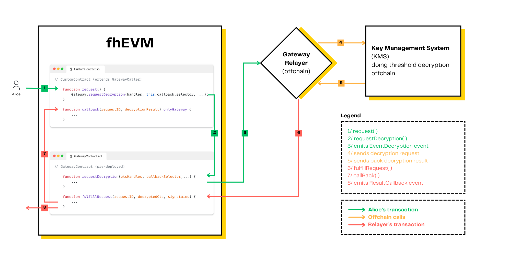

# Decrypt and reencrypt

## How it's working

Validators of the blockchain do not own the blockchain's private key. Instead, the private key is owned by a Key Management Service (KMS). If the plaintext value is needed at some point, there are two ways to obtain it. Both methods are handled by a service called the Gateway.

- If the plaintext is needed for some logic in a contract, the Gateway acts as an oracle service: it will listen to decryption request events and return the decrypted value through a callback function.
- If the plaintext is needed by a dApp, the Gateway provides an API to reencrypt a ciphertext with the dApp's public key.

## Decryption

We allow explicit decryption requests for any encrypted type. The values are decrypted with the network private key.

You can read about an actual implemention in [our decryption guide](../guides/decrypt.md).

## Reencrypt

Reencryption is performed on the client side by calling the gateway service using the [fhevmjs](https://github.com/zama-ai/fhevmjs/) library. To do this, you need to provide a view function that returns the ciphertext to be reencrypted.

1. The dApp retrieves the handle from the view function (e.g., balanceOf).
2. The dApp generates a keypair for the user and requests the user to sign the public key.
3. The dApp calls the gateway, providing the handle, public key, user address, contract address, and the user's signature.
4. The dApp decrypts the received value with the private key.

You can read [our guide explaining how to use it](../guides/reencryption.md).
